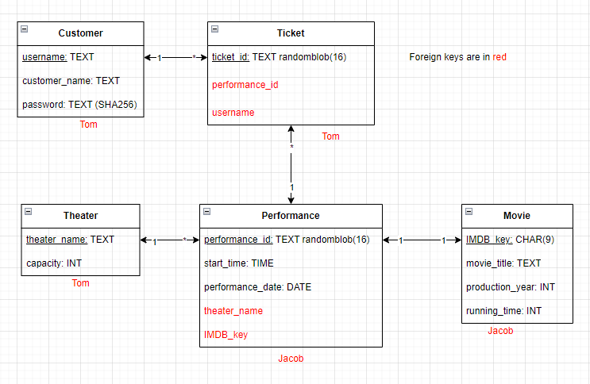

# Lab 2: Answers

## Question 1:
The entity sets required for modeling the movie theater chain are as follows:
1. Theater
2. Performance
3. Movie
4. Customer
5. Ticket

## Question 2:
| **Relationship**         | **Cardinality** | **Key(s) Used** |
|--------------------------|-----------------|-----------------|
| Theater <--> Performance |      1 to *     |   theater_name  |
| Performance <--> Movie   |      1 to 1     |     IMDB_key    |
| Performance <--> Ticket  |      1 to *     |  performance_id |
| Customer <--> Ticket     |      1 to *     |     username    |

## Question 3:
The attributes of the tables are defined below.
Note that bolded attributes denote primary keys and foreign keys are excluded.
| Theater                       |
|-------------------------------|
| **TheaterName:**  VARCHAR(50) |
| Capacity:     INT             |

| Performance |
|--------------------------------|
| **PerformanceId:** INT         |
| StartTime:         TIME        |
| PerformanceDate:   DATE        |

| Movie |
|--------------------------------|
| **IMDBKey:**        CHAR(9)    |
| MovieTitle:     VARCHAR(50)    |
| ProductionYear: INT            |
| RunningTime:    INT            |

| Customer                  |
|---------------------------|
| **Username:** VARCHAR(50) |
| CustomerName: VARCHAR(50) |
| UserPassword: VARCHAR(50) |

| Ticket                        |
|-------------------------------|
| **TicketID:** randomblob(16)  |

## Question 4:
The primary keys have already been identified above. The foreign keys can be
found in the 2nd image below in Question 5 (colored in red).
### (a) Which relations have natural keys?
* Ticket_id is a natural key
* Username is a natural key
* Theatre name is also a natural key given that the spec says that each name is unique
* Movie title is a natural key given the 1 year unique name assumption in the spec

### (b) Is there a risk that any of the natural keys will ever change?
* Yes there is a risk as Username, theatre and movie title may need be changed because of exterior needs and if that happens it would be necessary to update uproprietly the DB to prevent any issues.

### (c) Are there any weak entity sets?
* **No**, all entities in all our tables have unique primary attributes that are used to identify them individually.

### (d) In which relations do you want to use an invented key. Why?
* An inverted key can be used for performance where you can use a given time and date as well as a movie theater and the movie being shown to identify a specific performance. This is because their date and time attributes are not unique so you could have multiple inputs with those values.

## Question 5:
### UML Diagram

### UML Diagram w/ Foreign Keys (just for reference)

## Question 6: 
There are at least two ways of keeping track of the number of seats available for each performance – describe them both, with their upsides and downsides.

* Method 1: 

You could filter out the tickets table to those with a specific performance id which we could then use the count function to return the number of of tickets for a given performance have been sold and from there you could subtract the number by the total capacity.

The upside is that its an easy method to obtain the exact number of ticket that are currently sold, however it does come with the issue that you have to call it each time you want to keep track of this information.

* Method 2:

Another method could be adding a counter to the ticket table which gives the ticket a number of order in which it was sold such that it would count all new ticket instances that would have the performance id. 

This would be beneficial in that it could allow you to see the number of tickets sold, however it could have issues in that if any ticket is refunded it could not be accuratly displayed in the table.

## Question 7:
(See `DB_LAB2_Cleanup.sql` file)

## Question 8:
NOTE: We chose the name `theaters.sqlite` for our database