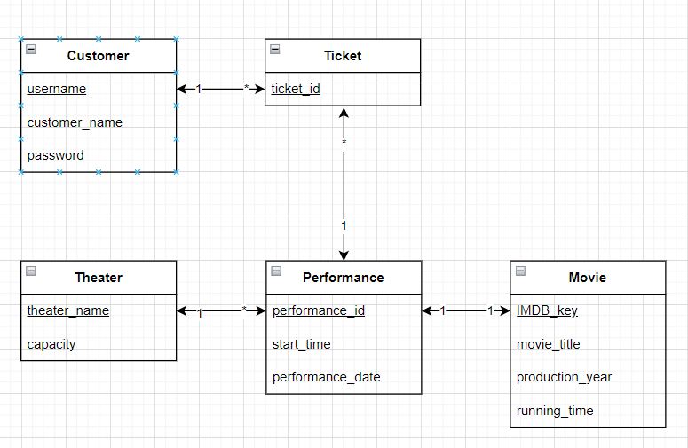
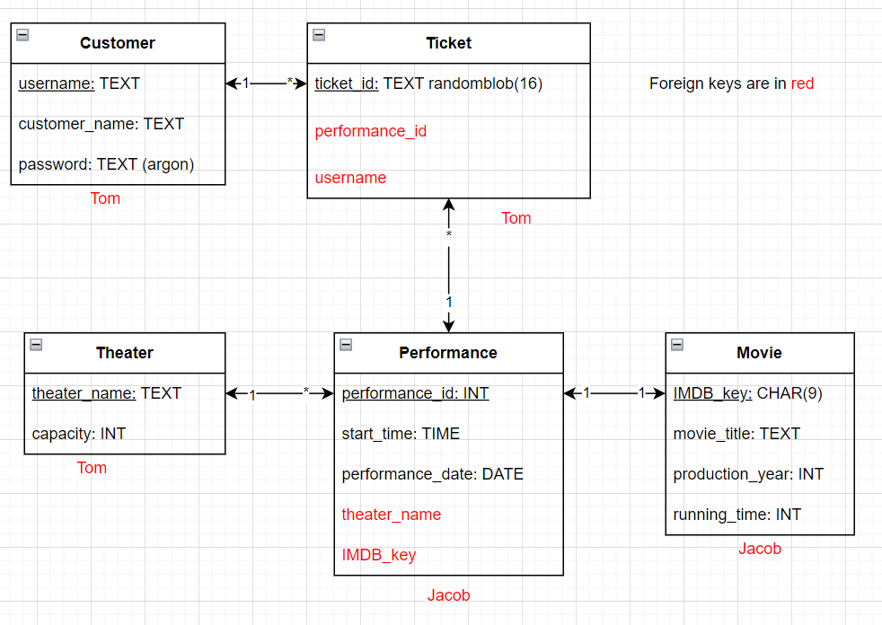

# Lab 2: Answers

## Question 1:
The entity sets required for modeling the movie theater chain are as follows:
1. Theater
2. Performance
3. Movie
4. Customer
5. Ticket

## Question 2:
| **Relationship**         | **Cardinality** | **Key(s) Used** |
|--------------------------|-----------------|-----------------|
| Theater <--> Performance |      1 to *     |   theater_name  |
| Performance <--> Movie   |      1 to 1     |     IMDB_key    |
| Performance <--> Ticket  |      1 to *     |  performance_id |
| Customer <--> Ticket     |      1 to *     |     username    |

## Question 3:
The attributes of the tables are defined below.
Note that bolded attributes denote primary keys and foreign keys are excluded.
| Theater                       |
|-------------------------------|
| **TheaterName:**  VARCHAR(50) |
| Capacity:     INT             |

| Performance |
|--------------------------------|
| **PerformanceId:** INT         |
| StartTime:         TIME        |
| PerformanceDate:   DATE        |

| Movie |
|--------------------------------|
| **IMDBKey:**        CHAR(9)    |
| MovieTitle:     VARCHAR(50)    |
| ProductionYear: INT            |
| RunningTime:    INT            |

| Customer                  |
|---------------------------|
| **Username:** VARCHAR(50) |
| CustomerName: VARCHAR(50) |
| UserPassword: VARCHAR(50) |

| Ticket                        |
|-------------------------------|
| **TicketID:** randomblob(16)  |

## Full E/R Model
### UML Diagram

### UML Diagram w/ Foreign Keys

## Question 4:
### (a) Which relations have natural keys?
* Ticket_id is a natural key
* Username is a natural key
* Theatre name is also a natural key given that the spec says that each name is unique
* Movie title is a natural key (given the 1 year unique name assumption in the spec)

### (b) Is there a risk that any of the natural keys will ever change?
* asdf

### (c) Are there any weak entity sets?
* asdf

### (d) In which relations do you want to use an invented key. Why?
* Ticket and performance?

## Question 5:

## Question 6: 
There are at least two ways of keeping track of the number of seats available for each performance – describe them both, with their upsides and downsides.
* Method 1:
* Method 2:
